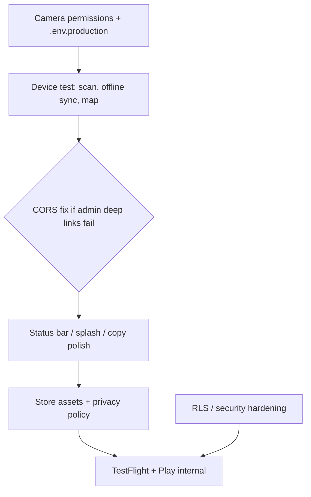

## Assessment

You're further along than a typical "wrap the PWA" project. Capacitor 8 is wired up, `npm run build` and `cap sync` succeed, and several mobile-specific decisions are already in place. The attendee experience is the real store target; admin is intentionally web/deep-link only on native.

---

## What's already in good shape

| Area | Status |
|------|--------|
| **Capacitor shell** | iOS + Android projects, `com.landfx.passport`, `build:mobile` script |
| **Native layout** | `.app-stage.is-native` removes the phone mockup frame, adds safe-area padding |
| **Service worker** | Disabled on native in `main.jsx` (avoids WebView cache fights) |
| **API routing** | `resolveApiUrl()` points native builds at production Vercel |
| **Deep links** | `landfxpassport://admin` + `useAppDeepLinks`; Android intent filters configured |
| **Offline sync** | localStorage queue + flush on reconnect in `passportRepository` |
| **QR scanning** | `getUserMedia` + jsQR (works in Capacitor WebView once permissions exist) |
| **Icons / splash** | Asset catalogs and Android mipmaps present |

---

## Blockers before you can ship

### 1. Camera permissions (will fail review / runtime)

Neither platform declares camera access:

- **iOS** `Info.plist` — missing `NSCameraUsageDescription`
- **Android** `AndroidManifest.xml` — only `INTERNET`; no `CAMERA`

Without these, QR scanning will fail on real devices and Apple will reject the app.

### 2. Production env baked into the mobile build

Supabase keys are compile-time `VITE_*` vars. A mobile build without `.env.production` ships with empty config and cloud sync won't work.

Create `.env.production` (or CI secrets) with at least:

```bash
VITE_SUPABASE_URL=...
VITE_SUPABASE_ANON_KEY=...
VITE_CLOUD_FIRST=true
VITE_API_BASE_URL=https://tradeshow-passport-raffle.vercel.app
```

Then: `npm run build:mobile` before every native run/archive.

README references `.env.example` but that file doesn't exist yet — worth adding.

### 3. CORS for native admin API calls

`api/_lib/cors.js` only allows browser origins (localhost, vercel.app). Capacitor WebView requests come from origins like `https://localhost`, which aren't allowlisted.

Attendee flows hit Supabase directly and are fine. Admin login/invite/reset from the native app (via deep link) may fail with CORS errors until you add Capacitor origins or use `@capacitor-community/http`.

### 4. Real-device validation (not optional)

Simulators won't tell you enough. You need physical devices for:

- Camera QR scanning under show-floor lighting
- Offline scan → reconnect → sync
- Map pinch-zoom performance
- Safe areas on notched iPhones / gesture nav Android
- Keyboard covering raffle signup fields

---

## Recommended remaining code steps

### Phase A — Make native builds work (1–2 days)

1. **Add camera permissions**
   - iOS: `NSCameraUsageDescription` — e.g. "Scan booth QR codes to collect passport stamps."
   - Android: `android.permission.CAMERA` (+ runtime request on API 23+ if needed)

2. **Fix CORS for Capacitor** — add to `ALLOWED_ORIGINS`:
   - `https://localhost`
   - `capacitor://localhost`
   - `http://localhost` (older Capacitor)

3. **Document / add `.env.example`** with all `VITE_*` and server vars.

4. **Verify build pipeline** on a Mac (iOS) and any machine (Android):
   ```bash
   npm run build:mobile
   npx cap open ios      # archive → TestFlight
   npx cap open android  # build signed AAB
   ```

### Phase B — Polish native UX (2–4 days)

5. **Status bar + splash** — install `@capacitor/status-bar` and `@capacitor/splash-screen`; match brand color `#007b70`.

6. **Keyboard handling** — if signup/admin forms get obscured, add `@capacitor/keyboard`.

7. **Universal links (optional but recommended)** — you have Android App Links intent filters and iOS URL scheme, but no hosted verification:
   - `/.well-known/apple-app-site-association` on your domain
   - `/.well-known/assetlinks.json` for Android
   - iOS Associated Domains entitlement

   Without this, admin invite emails open in Safari instead of the app (custom scheme `landfxpassport://` works if `ADMIN_INVITE_DEEP_LINK_URL` is set in Vercel).

8. **QR scanner fallback** — keep `getUserMedia` for v1; if field testing is flaky, switch native builds to `@capacitor-mlkit/barcode-scanning` with web fallback.

9. **Copy cleanup** — `index.html` and `manifest.webmanifest` still say "mockup"; update for store submission.

### Phase C — Store prep (1–2 weeks, mostly non-code)

10. **App icons** — regenerate final 1024×1024 source via `@capacitor/assets` (you have placeholder sets).

11. **Screenshots** — 6.7" iPhone, Android phone; show Home, Scan, Booths, Map, raffle entry.

12. **Privacy policy URL** — required (you collect name, email, phone, camera). Host on your site and link in both store listings.

13. **Permission justification** — store listing copy explaining camera = booth QR scanning.

14. **Developer accounts** — Apple ($99/yr), Google Play ($25 one-time).

15. **Signing** — iOS distribution cert + provisioning profile; Android upload keystore (back it up).

16. **TestFlight / Play internal testing** before public release.

---

## Security note (launch readiness, not just mobile)

`SECURITY_AUDIT.md` flags open Supabase RLS on `passport_state` and anonymous storage uploads. That affects web and native equally — a motivated person could read/overwrite event data with the public anon key.

For a real tradeshow with PII and raffle integrity, I'd treat RLS hardening as a **pre-launch requirement**, not a post-launch nice-to-have. Your `notes/TODOS/Data & Security Remediation Plans.md` has the remediation path.

---

## Suggested priority order



**Minimum viable store submission:** Phase A + device testing + Phase C items 11–16.

**Confident show-floor launch:** add Phase B polish + security remediation.

---

## Quick verdict

The codebase is ~70% ready for native mobile. Capacitor integration and mobile-aware UI are done; what's left is mostly **platform permissions**, **production build config**, **real-device QA**, and **store/compliance paperwork**. The largest functional gap is camera permissions; the largest strategic gap is Supabase RLS before running a live event with real attendee data.

If you want to tackle this in order, I'd start with camera permissions + `.env.production` + a TestFlight build — that unblocks everything else. I can implement Phase A in the repo if you'd like.