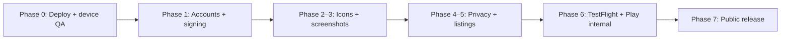

Here is a practical store-prep plan tailored to **Land F/X Passport** (`com.landfx.passport`), building on what's already done in the repo and what you listed.

---

## Current state (already handled in code)

| Item | Status |
|------|--------|
| Capacitor shell + `build:mobile` | Done |
| Camera permissions (iOS + Android) | Done |
| `.env.production` + mobile env docs | Done |
| CORS for Capacitor origins | Done (needs Vercel deploy) |
| Placeholder icons/splash | Present — replace before submission |

**Still required before submission:** final assets, legal pages, accounts, signing, device QA, store listings.

---

## Phase 0 — Unblock builds (1 day)

Do this before any store work.

1. **Deploy CORS fix to Vercel** — push to `main` or `vercel --prod`.
2. **Confirm production mobile build:**
   ```bash
   npm run build:mobile
   npx cap open ios      # Mac required
   npx cap open android
   ```
3. **Real-device smoke test** (not optional):
   - QR scan under normal lighting
   - Offline scan → reconnect → sync
   - Raffle signup (keyboard not covering fields)
   - Map pinch-zoom on a physical phone

Fix anything that fails here before investing in store assets.

---

## Phase 1 — Developer accounts & signing (2–3 days, mostly waiting)

### Apple — $99/yr

1. Enroll at [developer.apple.com](https://developer.apple.com/programs/) (Individual or Organization).
2. In **Certificates, Identifiers & Profiles**:
   - App ID: `com.landfx.passport` (must match `capacitor.config.json`)
   - Enable **Associated Domains** later if you add universal links
3. **Signing (Xcode handles most of this):**
   - Distribution certificate (Apple Development / Apple Distribution)
   - App Store provisioning profile for `com.landfx.passport`
4. In Xcode: **Signing & Capabilities** → Team → Automatic signing for dev; distribution cert for archive.

### Google Play — $25 one-time

1. Register at [play.google.com/console](https://play.google.com/console).
2. **Create upload keystore** (do this once, back it up permanently):
   ```bash
   keytool -genkey -v -keystore landfx-passport-upload.jks \
     -keyalg RSA -keysize 2048 -validity 10000 \
     -alias landfx-passport
   ```
3. Store securely (password manager + offline backup):
   - `landfx-passport-upload.jks`
   - Keystore password, key alias, key password
   - **If you lose this, you cannot update the app on Play Store.**
4. Add to `android/` (gitignored) or CI secrets:
   ```properties
   # android/keystore.properties (gitignore this)
   storeFile=../landfx-passport-upload.jks
   storePassword=...
   keyAlias=landfx-passport
   keyPassword=...
   ```

---

## Phase 2 — App icons & splash (1 day)

You have placeholder sets in `ios/App/App/Assets.xcassets/` and `android/app/src/main/res/`. Regenerate from a single final source.

### 1. Create final artwork

- **Icon:** 1024×1024 PNG, no transparency (Apple rejects alpha on store icon), no rounded corners (stores mask automatically).
- **Splash:** 2732×2732 PNG (or logo centered on `#007b70` brand background — your theme color).
- Brand: Land F/X Passport / tradeshow passport stamp motif.

### 2. Install Capacitor Assets

```bash
npm install @capacitor/assets --save-dev
mkdir -p resources
# Add resources/icon.png (1024×1024)
# Add resources/splash.png (2732×2732 or logo on solid bg)
npx capacitor-assets generate --iconBackgroundColor '#007b70' --splashBackgroundColor '#007b70'
npm run build:mobile
```

This regenerates iOS AppIcon, Android adaptive icons, and splash screens in native projects.

### 3. Verify in simulators

- iOS: icon on home screen, splash on cold launch
- Android: adaptive icon on launcher, splash on launch

---

## Phase 3 — Screenshots (1–2 days)

Capture from **production mobile builds** on real or simulator devices with realistic event data (not empty/mock state).

### Screens to capture (5 minimum)

| # | Screen | Why |
|---|--------|-----|
| 1 | **Home** | Passport progress, event branding |
| 2 | **Scan** | QR scanner active (shows camera use case) |
| 3 | **Booths** | Booth list with logos/categories |
| 4 | **Map** | Floor map with booth pins |
| 5 | **Raffle entry** | Signup form (shows data collection context) |

### Sizes

| Platform | Device | Resolution |
|----------|--------|------------|
| **App Store** | iPhone 6.7" (15 Pro Max) | 1290 × 2796 |
| **Play Store** | Phone | 1080 × 1920 minimum (1080 × 2340 common) |

**Tips:**
- Use iPhone 15 Pro Max simulator (Xcode) for 6.7" shots.
- Use Pixel 6/7 emulator or physical Android phone for Play Store.
- Hide debug UI, use a populated demo event.
- Update `manifest.webmanifest` description (still says "mockup") before capturing — store reviewers may compare listing to in-app copy.

Optional later: 6.5" iPhone, iPad (only if you declare iPad support), Play feature graphic (1024×500).

---

## Phase 4 — Privacy policy & permissions copy (1–2 days)

Both stores require a **public privacy policy URL** because you collect:

- Name, email, phone (raffle registration)
- Camera (QR scanning)
- Booth visit / scan data (passport progress)

### Privacy policy page

1. **Host on your site**, e.g.:
   `https://tradeshow-passport-raffle.vercel.app/privacy`
   (or `landfx.com/passport-privacy` if you prefer a corporate domain)
2. Cover at minimum:
   - What data you collect and why
   - How long you retain it (tie to your Plan 3 retention cron if applicable)
   - Third parties: Supabase, Vercel, Experient (if badge lookup is live)
   - Camera: used only for booth QR scanning, not stored as photos
   - Contact email for privacy requests / deletion
   - Children's privacy (likely "not directed at under 13")
3. Link from:
   - App Store Connect → App Privacy
   - Google Play Console → Data safety + Store listing
   - In-app signup screen (you already have terms text — add privacy link nearby)

### Permission justification (store listing + in-app)

**App Store Connect → App Review Information → Notes:**
> Camera access is used solely to scan booth QR codes at tradeshow expo booths. Photos and video are not recorded or stored.

**Google Play → Data safety + Permissions declaration:**
> Camera — required for QR code scanning at expo booths. No images are uploaded or stored.

**Already in app:** iOS `NSCameraUsageDescription` and Android `CAMERA` permission — keep wording aligned with store copy.

---

## Phase 5 — Store listing metadata (half day)

Draft copy once; reuse across both stores with minor edits.

| Field | Suggested content |
|-------|-------------------|
| **App name** | Land F/X Passport |
| **Subtitle / short desc** | Collect expo booth stamps and enter the raffle |
| **Description** | Visit participating booths, scan QR codes to fill your passport, and unlock raffle entry at ASLA and other Land F/X events. |
| **Keywords** (Apple) | tradeshow, passport, raffle, expo, landscape |
| **Category** | Business or Lifestyle |
| **Privacy policy URL** | Your hosted `/privacy` page |
| **Support URL / email** | e.g. `support@landfx.com` |
| **Copyright** | © 2026 Land F/X |

**Apple App Privacy questionnaire:** declare contact info, identifiers, usage data (scans), camera (not collected as media — used for scanning only).

**Google Data safety:** same declarations; complete content rating questionnaire (likely Everyone / low maturity).

---

## Phase 6 — Internal testing (1 week)

Do not go straight to public release.

### iOS — TestFlight

1. Xcode → **Product → Archive** → **Distribute App** → App Store Connect.
2. App Store Connect → **TestFlight** → add internal testers (up to 100, no review).
3. Test checklist:
   - Fresh install → signup → scan → sync → raffle entry
   - Admin deep link (optional): `landfxpassport://admin`
   - Airplane mode scan queue → reconnect
4. When stable, add external testers (requires brief Beta App Review).

### Android — Play internal testing

1. Android Studio → **Build → Generate Signed Bundle (AAB)**.
2. Play Console → **Internal testing** track → upload AAB.
3. Add tester emails; share opt-in link.
4. Same checklist as iOS.

**Fix all blockers from testers before promoting to production.**

---

## Phase 7 — Production submission

### Apple App Store

1. App Store Connect → create app → bundle ID `com.landfx.passport`.
2. Upload screenshots (6.7" required), icon, description, privacy URL, age rating.
3. Select TestFlight build → **Submit for Review**.
4. Review time: typically 24–48 hours (can be longer).

### Google Play

1. Create app → Production (or start with Closed testing).
2. Upload AAB, screenshots, feature graphic, Data safety form, content rating.
3. **Roll out** to production (staged rollout recommended: 10% → 50% → 100%).

---

## Suggested timeline



| Phase | Effort | Calendar |
|-------|--------|----------|
| 0 — Unblock builds | 1 day | Week 1 |
| 1 — Accounts & signing | 2–3 days | Week 1 (Apple enrollment can take 24–48h) |
| 2–3 — Icons & screenshots | 2–3 days | Week 2 |
| 4–5 — Privacy & listings | 2 days | Week 2 |
| 6 — Internal testing | 5–7 days | Week 3 |
| 7 — Store review | 3–14 days | Week 3–4 |

**Realistic first public release: 3–4 weeks** from today, assuming no major device QA surprises.

---

## Pre-launch checklist (printable)

**Code & infra**
- [ ] CORS fix deployed to Vercel
- [ ] `npm run build:mobile` with `.env.production`
- [ ] Real-device QA passed
- [ ] `manifest.webmanifest` / store copy no longer says "mockup"

**Assets**
- [ ] Final 1024×1024 icon → `@capacitor/assets generate`
- [ ] Splash screens regenerated
- [ ] 5 screenshots × iPhone 6.7"
- [ ] 5 screenshots × Android phone

**Legal & compliance**
- [ ] Privacy policy live at public URL
- [ ] Privacy link in app signup flow
- [ ] Camera permission justification in store listings
- [ ] Apple App Privacy + Google Data safety forms completed

**Accounts & signing**
- [ ] Apple Developer Program enrolled ($99/yr)
- [ ] Google Play Console account ($25)
- [ ] iOS distribution cert + provisioning profile
- [ ] Android upload keystore created and backed up

**Release**
- [ ] TestFlight internal testing complete
- [ ] Play internal testing complete
- [ ] Production submission to both stores

---

## Strategic note (not store paperwork, but launch-critical)

Your review doc flags **Supabase RLS hardening** before a live event with real attendee PII. Store approval and show-floor safety are separate — Apple/Google won't check your database policies. Plan that remediation in parallel with store prep if you're targeting a real tradeshow date.

---

I can turn this into a tracked doc in `notes/TODOS/`, scaffold the `/privacy` page on Vercel, or set up `@capacitor/assets` in the repo — say which you want first.