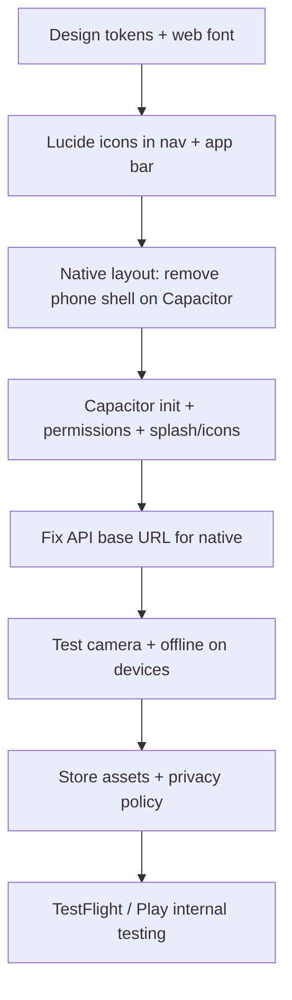

Here’s a practical roadmap that fits this codebase: Capacitor for stores, light CSS modernization, and a simple icon upgrade—without over-engineering.

---

## Part 1: Capacitor for App Store / Play Store

### What you have today

- React + Vite SPA, deployed to Vercel
- PWA (`manifest.webmanifest`, `sw.js`)
- Serverless APIs in `/api` (admin invite/reset)
- Supabase for auth + data
- Camera via browser `getUserMedia` + `jsqr`

Capacitor wraps your **built web app** in a native shell. You keep most of the React code; you add native projects, config, and a few mobile-specific adjustments.

### Phase 1 — Capacitor setup (1–2 days)

1. **Install Capacitor**
   ```bash
   npm install @capacitor/core @capacitor/cli
   npx cap init "Land F/X Passport" com.landfx.passport  # adjust bundle ID
   npm install @capacitor/ios @capacitor/android
   ```

2. **Configure `capacitor.config.ts`**
   - `webDir: 'dist'` (Vite output)
   - `server.url` only for live-reload dev against `npm run dev` — remove for production builds

3. **Build + sync workflow**
   ```bash
   npm run build
   npx cap sync
   npx cap open ios    # Xcode
   npx cap open android # Android Studio
   ```

4. **Add npm scripts**
   - `"build:mobile": "vite build && cap sync"`
   - Document the loop: change code → build → sync → run in simulator/device

### Phase 2 — Mobile-specific code changes (2–4 days)

| Area | Change |
|---|---|
| **Phone shell UI** | On native, drop the faux “phone frame” (`.app-stage` padding, border, shadow). Use full-screen layout + safe-area insets. Detect with `@capacitor/core` `Capacitor.isNativePlatform()`. |
| **Safe areas** | Add `env(safe-area-inset-*)` padding on header, bottom nav, and map overlays. |
| **Service worker** | Disable SW registration when running natively — it can fight Capacitor’s WebView caching. Keep SW for web/PWA only. |
| **API routes** | `/api/invite-admin` and `/api/reset-admin-password` won’t exist inside the app bundle. Point fetches at your production URL, e.g. `https://tradeshow-passport-raffle.vercel.app/api/...`, or extract those into a standalone backend. |
| **Supabase env** | Same `VITE_*` vars baked in at build time — fine for mobile builds via CI or local `.env.production`. |
| **Deep links** | Optional: `@capacitor/app` for admin invite/reset links opening the app instead of the browser. |
| **Status bar / splash** | `@capacitor/status-bar`, `@capacitor/splash-screen` for polish. |
| **Keyboard** | `@capacitor/keyboard` if forms get obscured on small screens. |

### Phase 3 — Camera / QR scanning (1–2 days)

Two paths:

**A. Keep current approach (fastest)**  
`getUserMedia` works in Capacitor’s WebView if you add platform permissions:

- **iOS** `Info.plist`: `NSCameraUsageDescription`
- **Android** `AndroidManifest.xml`: `CAMERA` permission

Test on real devices — iOS WebView camera behavior can differ from Safari.

**B. Native scanner (more professional)**  
Use `@capacitor-community/barcode-scanner` or `@capacitor-mlkit/barcode-scanning` for faster, more reliable scanning. You’d refactor `ScannerPanel.jsx` to call the plugin on native and fall back to `jsqr` on web.

Recommendation: start with **A**, move to **B** if scanning feels flaky in the field.

### Phase 4 — Store assets & compliance (3–5 days)

| Requirement | Notes |
|---|---|
| **App icons** | iOS: 1024×1024 + full icon set via Xcode asset catalog. Android: adaptive icon (foreground + background). Use `@capacitor/assets` to generate from one source image. |
| **Splash screens** | Brand color + logo; generate via Capacitor Assets. |
| **Privacy policy URL** | Required for both stores (you collect name, email, phone, camera). |
| **App Store Connect** | Apple Developer account ($99/yr), app description, screenshots (6.7", 6.5", iPad if supporting tablets). |
| **Google Play Console** | One-time $25, feature graphic, screenshots, content rating questionnaire. |
| **Permissions justification** | Camera = QR booth scanning. Clear copy in store listing and in-app permission prompt. |

### Phase 5 — CI / release pipeline (1–2 days)

- GitHub Action: `npm ci` → `npm run build` → `cap sync` → archive iOS / build Android AAB
- iOS: Fastlane or Xcode Cloud for TestFlight
- Android: upload AAB to Play Console internal testing first

### Realistic timeline

| Scope | Estimate |
|---|---|
| Capacitor shell + dev builds working | ~1 week |
| Mobile UX polish + API fixes + camera testing | ~1–2 weeks |
| Store assets, legal, review cycles | ~2–4 weeks (review time varies) |

**Total:** roughly **3–6 weeks** to first store submission, depending on how much you polish and whether Apple review asks for changes.

---

## Part 2: CSS recommendations (simple but more professional)

You don’t need a full framework. The biggest win is **structure + design tokens**, not Tailwind everywhere.

### Recommended approach: “token layer + split CSS”

Keep plain CSS, but reorganize:

```
src/styles/
  tokens.css      # colors, spacing, radius, shadows, typography
  reset.css       # current index.css basics
  layout.css      # app shell, safe areas, grid
  components/     # optional: nav.css, booth-card.css, admin.css
```

Import order in `main.jsx`: tokens → reset → layout → App.css (then gradually migrate chunks out of App.css).

### Design token upgrades

Expand `:root` with a small, consistent system:

```css
:root {
  /* Brand */
  --color-primary: #007b70;
  --color-primary-dark: #005a52;
  --color-accent: #ee5730;

  /* Neutrals */
  --color-bg: #f8f7f4;
  --color-surface: #ffffff;
  --color-border: #e5e2dc;
  --color-text: #1a1a2e;
  --color-text-muted: #6b7280;

  /* Spacing scale (4px base) */
  --space-1: 4px;
  --space-2: 8px;
  --space-3: 12px;
  --space-4: 16px;
  --space-6: 24px;
  --space-8: 32px;

  /* Radius */
  --radius-sm: 8px;
  --radius-md: 12px;
  --radius-lg: 16px;
  --radius-full: 9999px;

  /* Shadows — subtle, not heavy */
  --shadow-sm: 0 1px 2px rgba(0,0,0,0.06);
  --shadow-md: 0 4px 12px rgba(0,0,0,0.08);

  /* Typography */
  --font-sans: 'Inter', system-ui, -apple-system, sans-serif;
  --text-sm: 0.875rem;
  --text-base: 1rem;
  --text-lg: 1.125rem;
  --text-xl: 1.25rem;
}
```

Add **Inter** (or **DM Sans**) via Google Fonts or `@fontsource/inter` — one weight change makes the app feel much more modern than Arial.

### Specific UI improvements (high impact, low complexity)

1. **Remove the demo “phone bezel” on real devices** — full-bleed native app; keep the frame only for desktop preview if you want.
2. **Bottom nav** — icon + short label, active state with primary color + subtle top indicator (not just text color). Fixed height with safe-area padding.
3. **Cards** — white surface, `--radius-md`, `--shadow-sm`, consistent `--space-4` padding. Booth cards and summary panel benefit most.
4. **Buttons** — one primary style (filled), one secondary (outline), one ghost. Today `.primary` and `.button-link` can be tightened into a small set.
5. **Typography hierarchy** — fewer font sizes; use weight (600/700) for headings, `--color-text-muted` for secondary text.
6. **Reduce decorative noise** — the radial-gradient background on `.app-stage` reads as “mockup”; native app → flat `--color-bg` or very subtle gradient.
7. **Admin dashboard** — same tokens; sidebar with `--color-surface` and clearer section spacing. Admin is desktop-first but should still feel like the same product.
8. **Motion** — keep confetti/winner animations; shorten durations slightly; use `prefers-reduced-motion` for accessibility.

### What I’d avoid (for “simple”)

| Option | Why skip for now |
|---|---|
| **Full Tailwind** | Large migration; 3,300 lines in `App.css` is a big rewrite |
| **MUI / Chakra** | Heavy; fights your custom “phone app” layout |
| **CSS-in-JS** | Extra bundle + complexity for little gain here |

**Sweet spot:** design tokens + split files + one web font. Refactor components opportunistically when you touch them.

---

## Part 3: Icon library recommendations

Replace Unicode glyphs (`▮`, `●`, `▣`) with a proper icon set.

### Top pick: **Lucide React**

```bash
npm install lucide-react
```

**Why it fits this project:**
- Clean, consistent stroke icons (reads modern/professional)
- Tree-shakeable — import only what you use
- Great React API: `<Home size={22} />`
- Large set: `Home`, `BookOpen`, `QrCode`, `LayoutGrid`, `Map`, `Settings`, `LogOut`, `Check`, `X`

**Bottom nav example:**

```jsx
import { Home, BookOpen, QrCode, LayoutGrid, Map } from 'lucide-react'

const attendeeTabs = [
  { id: 'Home', icon: Home, label: 'Home' },
  { id: 'Instructions', icon: BookOpen, label: 'Info' },
  { id: 'QR Scanner', icon: QrCode, label: 'Scan' },
  { id: 'Booths', icon: LayoutGrid, label: 'Booths' },
  { id: 'Map', icon: Map, label: 'Map' },
]

// In render:
const Icon = tab.icon
<Icon size={22} strokeWidth={activeTab === tab.id ? 2.5 : 2} />
```

Use **shorter labels** on mobile (“Scan” not “QR Scanner”) — icons carry meaning.

### Alternatives

| Library | Best for |
|---|---|
| **Heroicons** (`@heroicons/react`) | If you prefer Tailwind’s aesthetic later |
| **Phosphor** (`@phosphor-icons/react`) | Slightly softer, friendly trade-show vibe |
| **Tabler Icons** | Very complete set, similar to Lucide |

**Recommendation:** **Lucide** — best balance of professional, lightweight, and easy drop-in for your current JSX structure.

### Icon usage guidelines

- **Size:** 22–24px in bottom nav; 20px in app bar buttons
- **Active state:** primary color + slightly heavier stroke (`strokeWidth={2.5}`)
- **Inactive:** `--color-text-muted`
- **Always pair with `aria-label`** on icon-only buttons (you already do this in places — keep it)

---

## Suggested implementation order



1. **CSS tokens + Lucide** — visible improvement on web immediately; low risk  
2. **Capacitor shell** — get iOS/Android simulators running  
3. **Native-specific fixes** — layout, API URLs, SW, permissions  
4. **Device testing** — camera, map pinch-zoom, offline queue  
5. **Store submission** — assets, legal, review  

---

## Quick “before / after” vision

| Today | Target |
|---|---|
| Unicode nav icons | Lucide icons + shorter labels |
| Arial, phone mockup frame | Inter, full-screen on native |
| 3,300-line monolithic CSS | Tokens + 3–4 logical CSS files |
| PWA only | PWA **plus** Capacitor iOS/Android |
| Relative `/api/*` calls | Absolute production API URL in native builds |

---

If you want to move forward, a sensible first PR would be: **design tokens + Lucide icons + native-aware layout** (no Capacitor yet). Second PR: **Capacitor init + permissions + store asset pipeline**. I can implement either phase when you’re ready.